# ComfyUI-BlenderAI-node
Add-on for using [ComfyUI](https://github.com/comfyanonymous/ComfyUI) in Blender.
## Function Introduction
1. Automatically convert Comfyui nodes to Blender nodes, enabling Blender to directly generate images using ComfyUI（As long as your ComfyUI can run）
2. Multiple Blender dedicated nodes(For example, directly inputting camera rendered images, compositing data, etc. into COMFYUI)
3. Operation optimization (such as one click drawing mask)
4. Node group presets
5. Queue batch processing
## How to install(Only on WINDOWS 10\11)

1 .**Blender**

Firstly, you need to install a [Blender](https://www.blender.org/download/)(Suggest Blender 3.5 or 3.6.X, previous versions or 4.0 have not been tested).

2. **Add-on（ComfyUI BlenderAI node）**
ComfyUI BlenderAI node is a standard Blender add-on. Just download the compressed package and install it like any other add-ons.

[中文](README.md) [EN](README_EN.md)

[工具手册](https://shimo.im/docs/Ee32m0w80rfLp4A2)

[AIGODLIKE社区](www.aigodlike.com)

# Blender开源AI工具无限圣杯节点

## 第零章 前言

### 简介

> 无限圣杯工具是由只剩一瓶辣椒酱-幻之境开发小组开发的一款基于STABLE DIFFUISON ComfyUI核心的Blender AI工具，它将以开源&免费的方式提供给blender用户使用。

### 下载地址

## [百度网盘](https://pan.baidu.com/s/1bnVWO9AuurPl2mn9Uc57vg?pwd=2333)

## [Google Driver](https://drive.google.com/drive/folders/1Akqh3qPt-Zzi_clqkoCwCl_Xjo78FfbM?usp=sharing)

视频教程

#### B站全集(更新中)

# [Blender x ComfyUI节点式AI绘画大冒险-00安装与部署(含满血版整合包)](https://www.bilibili.com/video/BV1Fo4y187HC/)
第二章 全节点介绍（中文）

编写者-谷缘芷月、只剩一瓶辣椒酱

## 采样

### K 采样器

K 采样器可以将噪波加入到潜空间中，然后逐渐去除噪波重生成潜空间。

#### **随机种**

* 指定生成噪波的随机种
* <每次运行节点随机>每次运行，随机该采样器的随机种
* <随机全部>每次运行，随机全部采样器的随机种
* <统一随机>每次运行，随机该采样器的随机种，并将全部采样器的随机种设为该随机种
#### **步数**

* 指定去除噪波的次数
#### **CFG**

* 控制 prompt 对于采样的影响程度
#### **采样器**

* 指定要使用的采样器
#### **调度器**

* 指定要使用的调度器，用于调整每次去除噪波时的程度
    * karras：非线性采样
    * normal：等距的间隔采样
    * simple：近似等距的间隔采样，是最简单的调度器
    * ddim_uniform：官方效果，推荐与 ddim 结合使用
* 通常情况下仅使用 karras
#### **降噪**

* 指定要要加入的噪波数量，一般适用于图生图。
#### 特别说明

* CFG无法设置为负数
* 降噪不能为0
* 当<随机全部>开启时，全部采样器会锁定开启，无法设置单个节点关闭随机
* 当<统一随机>开启时，全部采样器会锁定关闭，无法设置多个节点开启统一
* 使用<统一随机>前需要开启<随机全部>
* 输入latent图像的分辨率需要为64的整数倍
#### 相关节点

* [checkpoint简易加载器](https://shimo.im/docs/Ee32m0w80rfLp4A2#anchor-KF2C 《无限圣杯AI节点(ComfyUI)使用者手册》)
* [CLIP文本编码器](https://shimo.im/docs/Ee32m0w80rfLp4A2#anchor-jthz 《无限圣杯AI节点(ComfyUI)使用者手册》)
* [VAE解码](https://shimo.im/docs/Ee32m0w80rfLp4A2#anchor-T9uA 《无限圣杯AI节点(ComfyUI)使用者手册》)
* [高级 K 采样器](https://shimo.im/docs/Ee32m0w80rfLp4A2#anchor-IJ7C 《无限圣杯AI节点(ComfyUI)使用者手册》)
### 高级 K 采样器

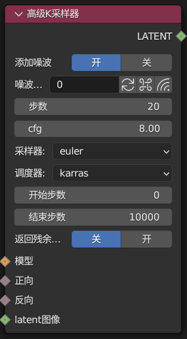

提供了更多选项的 K 采样器。

#### **添加噪波**

* 开关是否添加噪波
#### **开始步数**

* 指定开始添加噪波的步数
#### **添加噪波**

* 指定结束添加噪波的步数
#### **返回残余噪波**

* 选择是否返回尚未降噪的噪波，具体表现为返回噪波画面
#### 相关节点

* [checkpoint简易加载器](https://shimo.im/docs/Ee32m0w80rfLp4A2#anchor-KF2C 《无限圣杯AI节点(ComfyUI)使用者手册》)
* [CLIP文本编码器](https://shimo.im/docs/Ee32m0w80rfLp4A2#anchor-jthz 《无限圣杯AI节点(ComfyUI)使用者手册》)
* [VAE解码](https://shimo.im/docs/Ee32m0w80rfLp4A2#anchor-T9uA 《无限圣杯AI节点(ComfyUI)使用者手册》)
* [K 采样器](https://shimo.im/docs/Ee32m0w80rfLp4A2#anchor-UvgV 《无限圣杯AI节点(ComfyUI)使用者手册》)
## **加载器**

### **checkpoint 简易加载器**

能够加载 checkpoint(safetensor)文件中的模型、U-net、VAE 编码/解码器，输出为模型、CLIP、VAE。

#### 特别说明

* 加载器会自动识别模型的规格和版本，但并不完全准确。
* 默认不限制 CLIP 深度，可以使用<CLIP 设置最后一层>来限制 CLIP
#### 相关链接

* [checkpoint加载器](https://shimo.im/docs/Ee32m0w80rfLp4A2#anchor-rwwQ 《无限圣杯AI节点(ComfyUI)使用者手册》)
* [逆 CLIPcheckpoint 加载器](https://shimo.im/docs/Ee32m0w80rfLp4A2#anchor-0ACT 《无限圣杯AI节点(ComfyUI)使用者手册》)
* [扩散载入器](https://shimo.im/docs/Ee32m0w80rfLp4A2#anchor-6ZiQ 《无限圣杯AI节点(ComfyUI)使用者手册》)
* [CLIP 文本编码器](https://shimo.im/docs/Ee32m0w80rfLp4A2#anchor-jthz 《无限圣杯AI节点(ComfyUI)使用者手册》)
* [CLIP 设置最后一层](https://shimo.im/docs/Ee32m0w80rfLp4A2#anchor-OFAv 《无限圣杯AI节点(ComfyUI)使用者手册》)
### **VAE 加载器**

能够加载 VAE。

#### 相关节点

* [VAE解码](https://shimo.im/docs/Ee32m0w80rfLp4A2#anchor-T9uA 《无限圣杯AI节点(ComfyUI)使用者手册》)
* [VAE编码](https://shimo.im/docs/Ee32m0w80rfLp4A2#anchor-FJ4Q 《无限圣杯AI节点(ComfyUI)使用者手册》)
### **LoRA 加载器**

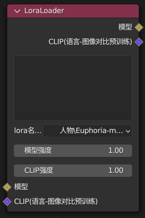

能够加载 LoRA 模型。

#### 特别说明

* 能够加载 LoHA、LoCON、LoKR 等模型
#### 相关节点

* [checkpoint 简易加载器](https://shimo.im/docs/Ee32m0w80rfLp4A2#anchor-KF2C 《无限圣杯AI节点(ComfyUI)使用者手册》)
* [CLIP加载器](https://shimo.im/docs/Ee32m0w80rfLp4A2#anchor-4xjf 《无限圣杯AI节点(ComfyUI)使用者手册》)
### **CLIP 加载器**

能够加载 CLIP 模型。

#### 相关节点

* [CLIP 文本编码器](https://shimo.im/docs/Ee32m0w80rfLp4A2#anchor-jthz 《无限圣杯AI节点(ComfyUI)使用者手册》)
* [逆 CLIPcheckpoint 加载器](https://shimo.im/docs/Ee32m0w80rfLp4A2#anchor-0ACT 《无限圣杯AI节点(ComfyUI)使用者手册》)
### **ControlNet 加载器**

能够加载 ControlNet 模型。

#### 相关节点

* [ControlNet 应用](https://shimo.im/docs/Ee32m0w80rfLp4A2#anchor-x81Z 《无限圣杯AI节点(ComfyUI)使用者手册》)
* [另一种 ControlNet 加载器](https://shimo.im/docs/Ee32m0w80rfLp4A2#anchor-cw0Z 《无限圣杯AI节点(ComfyUI)使用者手册》)
### **另一种 ControlNet 加载器**

另一种能够加载 ControlNet 模型的加载器。

#### 相关节点

* [ControlNet 加载器](https://shimo.im/docs/Ee32m0w80rfLp4A2#anchor-ZBu4 《无限圣杯AI节点(ComfyUI)使用者手册》)
### **视觉风格加载器**

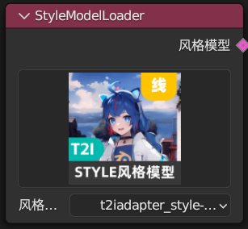

能够加载视觉风格模型。

#### 相关节点

* [风格模型应用](https://shimo.im/docs/Ee32m0w80rfLp4A2#anchor-jOYQ 《无限圣杯AI节点(ComfyUI)使用者手册》)
* [CLIP 视觉编码](https://shimo.im/docs/Ee32m0w80rfLp4A2#anchor-Gh0K 《无限圣杯AI节点(ComfyUI)使用者手册》)
### **CLIP 视觉加载器**

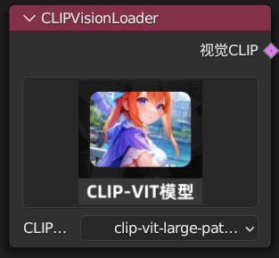

能够加载 CLIP 视觉模型。

#### 相关节点

* [CLIP 视觉编码](https://shimo.im/docs/Ee32m0w80rfLp4A2#anchor-Gh0K 《无限圣杯AI节点(ComfyUI)使用者手册》)
#### 使用例

### **逆 CLIPcheckpoint 加载器**

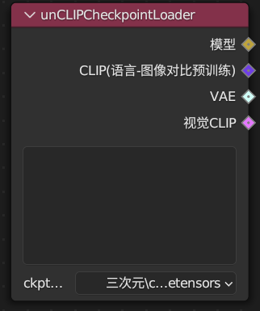

能够加载 checkpoint(safetensor)文件中的模型、CLIP 文本层、VAE 编码/解码器、CLIP 视觉层，输出为模型、CLIP、VAE、视觉 CLIP。

#### 相关节点

* [checkpoint 简易加载器](https://shimo.im/docs/Ee32m0w80rfLp4A2#anchor-KF2C 《无限圣杯AI节点(ComfyUI)使用者手册》)
* [CLIP 文本编码器](https://shimo.im/docs/Ee32m0w80rfLp4A2#anchor-jthz 《无限圣杯AI节点(ComfyUI)使用者手册》)
* [CLIP 视觉编码](https://shimo.im/docs/Ee32m0w80rfLp4A2#anchor-Gh0K 《无限圣杯AI节点(ComfyUI)使用者手册》)
#### 使用例

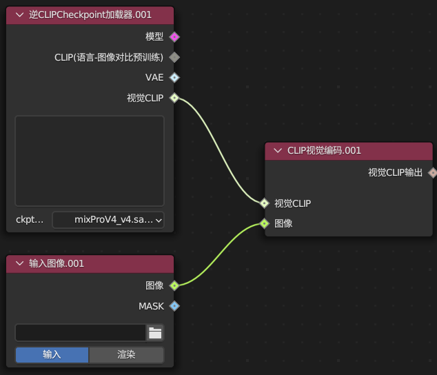

### **GLIGEN 加载器**

能够加载 GLIGEN 模型。

### 相关节点

* [GLIGEN 文本框应用](https://shimo.im/docs/Ee32m0w80rfLp4A2#anchor-f2Ff 《无限圣杯AI节点(ComfyUI)使用者手册》)
#### 使用例

### **超网格加载器**

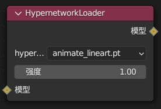

能够加载超网格模型。

#### 相关节点

* [checkpoint简易加载器](https://shimo.im/docs/Ee32m0w80rfLp4A2#anchor-KF2C 《无限圣杯AI节点(ComfyUI)使用者手册》)
* [K 采样器](https://shimo.im/docs/Ee32m0w80rfLp4A2#anchor-UvgV 《无限圣杯AI节点(ComfyUI)使用者手册》)
#### 使用例

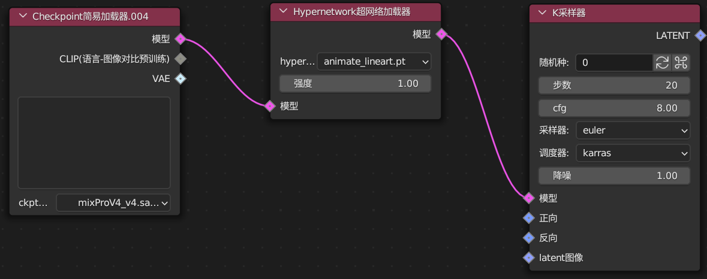

## 条件

### 风格模型

### 风格模型应用

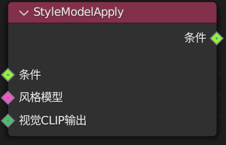

将视觉 CLIP 应用到条件中。

#### 特别说明

* 当上游节点中已经存在其他风格条件时，该风格会与上游风格叠加
* 需要搭配 CLIP 视觉编码使用
#### 相关节点

* [CLIP 加载器](https://shimo.im/docs/Ee32m0w80rfLp4A2#anchor-4xjf 《无限圣杯AI节点(ComfyUI)使用者手册》)
* [视觉风格加载器](https://shimo.im/docs/Ee32m0w80rfLp4A2#anchor-Bg14 《无限圣杯AI节点(ComfyUI)使用者手册》)
* [CLIP 视觉编码](https://shimo.im/docs/Ee32m0w80rfLp4A2#anchor-Gh0K 《无限圣杯AI节点(ComfyUI)使用者手册》)
#### 使用例

### GLIGEN 基于语言的图像生成

#### GLIGEN 文本框应用

## 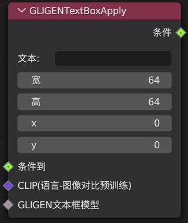

这个节点将条件中的指定文本限制到指定位置。

#### 宽高

* 指定区域大小。
#### XY

* 指定区域位置，坐标为左上角。
#### 特别说明

* 可以叠加使用以控制每个 prompt 的范围
* 当节点树上游存在已应用的条件时，该条件会与上游节点叠加应用
* 当一个条件被同时应用在不同范围后，会生成难以预料的结果
#### 相关节点

* [文本编码器](https://shimo.im/docs/Ee32m0w80rfLp4A2#anchor-jthz 《无限圣杯AI节点(ComfyUI)使用者手册》)
* [checkpoint 简易加载器](https://shimo.im/docs/Ee32m0w80rfLp4A2#anchor-KF2C 《无限圣杯AI节点(ComfyUI)使用者手册》)
* [GLIGEN 加载器](https://shimo.im/docs/Ee32m0w80rfLp4A2#anchor-chaq 《无限圣杯AI节点(ComfyUI)使用者手册》)
#### 使用例

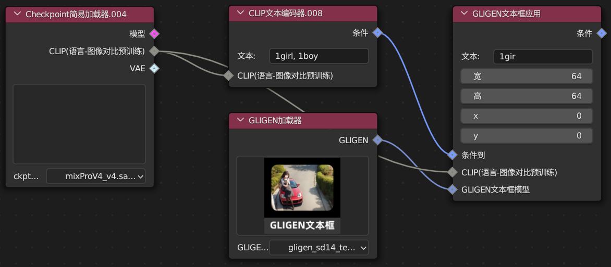

### CLIP 文本编码器

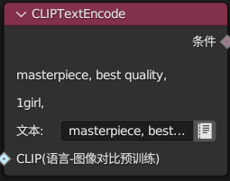

将文本内容编码为条件。

#### 文本

* 能够读取 Texture Inversion | Embedding，使用方法为"embedding:embdding_name"
* 当需要读取多个 embedding 时，使用“embedding:emb_1, embedding:emb_2”
#### 开启多行文本

* 打开用于编辑prompt的文本框
* 仅在选中该节点时显示文本框
* 支持常用符号，不支持换行、emoji、适用于webui的大部分语法。
#### 相关节点

* [checkpoint 简易加载器](https://shimo.im/docs/Ee32m0w80rfLp4A2#anchor-KF2C 《无限圣杯AI节点(ComfyUI)使用者手册》)
* [K 采样器](https://shimo.im/docs/Ee32m0w80rfLp4A2#anchor-deRh 《无限圣杯AI节点(ComfyUI)使用者手册》)
### CLIP 设置最后一层

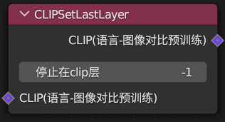

这个节点能够限制 CLIP 的深度。

#### 停止在 clip 层

* 当值为-1 时，无限制
* 当值为-2 时，在最后 1 层前停止
* 当值为-3 时，在最后 2 层前停止
#### 特别说明

* 这个节点会导致模型生成难以预料的结果，部分prompt可能依赖此设置
#### 相关节点

* [checkpoint 简易加载器](https://shimo.im/docs/Ee32m0w80rfLp4A2#anchor-KF2C 《无限圣杯AI节点(ComfyUI)使用者手册》)
* [文本编码器](https://shimo.im/docs/Ee32m0w80rfLp4A2#anchor-jthz 《无限圣杯AI节点(ComfyUI)使用者手册》)
#### 使用例

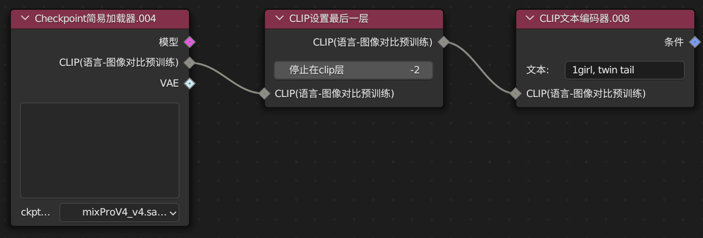

### 条件平均

按强度平均两个条件。

#### 条件到强度

* 指定混合强度，值越小，“条件源”效果越强
#### 特别说明

* 当“条件源”包含多组条件时，仅使用第一组条件
### 条件合并

组合两个条件。

#### 特别说明

* 组合就是简单的组合
* 通常与<条件区域>结合使用
* 组合后的条件会被分开输出，与同时输入一组条件效果不同
#### 相关节点

* [文本编码器](https://shimo.im/docs/Ee32m0w80rfLp4A2#anchor-jthz 《无限圣杯AI节点(ComfyUI)使用者手册》)
* [条件区域](https://shimo.im/docs/Ee32m0w80rfLp4A2#anchor-msbm 《无限圣杯AI节点(ComfyUI)使用者手册》)
### 条件区域

限制条件采样在指定区域，并且可以设置权重。

#### 宽高

* 指定区域大小
#### XY

* 指定区域位置，坐标为左上角
#### 强度

* 指定限制强度
#### 特别说明

* 这个节点的功能不是限制条件区域
* 如果存在没有任何条件的区域，计算会返回噪波
* 当上游节点已经存在条件时，该条件会覆盖上游条件
#### 相关节点

* [文本编码器](https://shimo.im/docs/Ee32m0w80rfLp4A2#anchor-jthz 《无限圣杯AI节点(ComfyUI)使用者手册》)
* [条件遮罩](https://shimo.im/docs/Ee32m0w80rfLp4A2#anchor-KiX1 《无限圣杯AI节点(ComfyUI)使用者手册》)
### 条件设置遮罩

通过遮罩限制条件采样在指定区域，并且可以设置权重。

#### 强度

* 指定条件强度
#### 设置条件区域

* 选择是否仅在遮罩内生成
#### 特别说明

* 这个节点的功能不是限制条件区域
* 如果存在没有任何条件的区域，计算会返回噪波
* 当上游节点已经存在条件时，该条件会覆盖上游条件
#### 相关节点

* [条件区域](https://shimo.im/docs/Ee32m0w80rfLp4A2#anchor-msbm 《无限圣杯AI节点(ComfyUI)使用者手册》)
* [条件合并](https://shimo.im/docs/Ee32m0w80rfLp4A2#anchor-0pZn 《无限圣杯AI节点(ComfyUI)使用者手册》)
#### 使用例

### CLIP 视觉编码

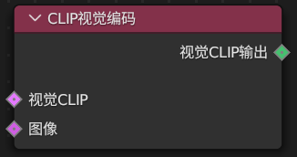

使用视觉 CLIP 编码图像。

#### 相关节点

* [逆 CLIPcheckpoint 加载器](https://shimo.im/docs/Ee32m0w80rfLp4A2#anchor-0ACT 《无限圣杯AI节点(ComfyUI)使用者手册》)
* [CLIP 视觉加载器](https://shimo.im/docs/Ee32m0w80rfLp4A2#anchor-USpG 《无限圣杯AI节点(ComfyUI)使用者手册》)
* [逆 CLIP 条件](https://shimo.im/docs/Ee32m0w80rfLp4A2#anchor-XZD8 《无限圣杯AI节点(ComfyUI)使用者手册》)
#### 使用例

### 逆 CLIP 条件

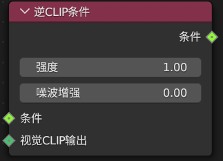

将<视觉 CLIP 编码>输出的图像应用到条件。

#### 特别说明

* 这个节点仅适用 unCLIP 模型
#### 相关节点

* [CLIP 文本编码器](https://shimo.im/docs/Ee32m0w80rfLp4A2#anchor-jthz 《无限圣杯AI节点(ComfyUI)使用者手册》)
* [CLIP 视觉编码](https://shimo.im/docs/Ee32m0w80rfLp4A2#anchor-Gh0K 《无限圣杯AI节点(ComfyUI)使用者手册》)
#### 使用例

### ControlNet 应用

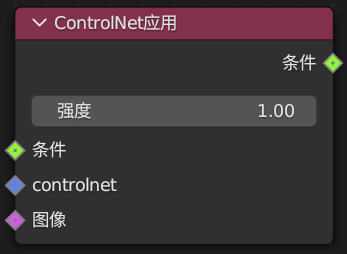

将 ControlNet 应用到条件。

#### 相关节点

* [ControlNet 加载器](https://shimo.im/docs/Ee32m0w80rfLp4A2#anchor-ZBu4 《无限圣杯AI节点(ComfyUI)使用者手册》)
* [CLIP 文本编码器](https://shimo.im/docs/Ee32m0w80rfLp4A2#anchor-jthz 《无限圣杯AI节点(ComfyUI)使用者手册》)
#### 使用例

## 潜空间

### 内补绘制

### VAE 内补编码器

编码图像为 latent，遮罩中色值大于0.5的区域会成为内补的目标。

#### 特别说明

* 遮罩输入会被拉伸为输入图像的大小
#### 相关节点

* [VAE 解码](https://shimo.im/docs/Ee32m0w80rfLp4A2#anchor-T9uA 《无限圣杯AI节点(ComfyUI)使用者手册》)
* [K 采样器](https://shimo.im/docs/Ee32m0w80rfLp4A2#anchor-UvgV 《无限圣杯AI节点(ComfyUI)使用者手册》)
#### 使用例

### 设置 latent 噪波遮罩

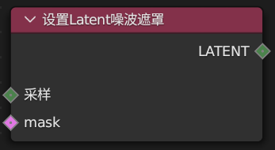

用噪波覆盖遮罩外的内容 latent。

#### 特别说明

* 被替代的噪波会影响剩余内容的生成
* 当上游节点已存在噪波遮罩时，该噪波会替代上游噪波
#### 相关节点

* [VAE 编码](https://shimo.im/docs/Ee32m0w80rfLp4A2#anchor-FJ4Q 《无限圣杯AI节点(ComfyUI)使用者手册》)
* [K 采样器](https://shimo.im/docs/Ee32m0w80rfLp4A2#anchor-UvgV 《无限圣杯AI节点(ComfyUI)使用者手册》)
### 变换

### Latent 旋转

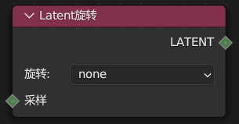

旋转 latent。

#### 旋转

* 顺时针旋转指定角度。
#### 相关节点

* [VAE 解码](https://shimo.im/docs/Ee32m0w80rfLp4A2#anchor-T9uA 《无限圣杯AI节点(ComfyUI)使用者手册》)
* [K 采样器](https://shimo.im/docs/Ee32m0w80rfLp4A2#anchor-UvgV 《无限圣杯AI节点(ComfyUI)使用者手册》)
### Latent 翻转

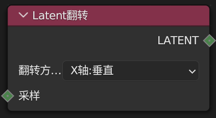

翻转 latent。

#### 相关节点

* [VAE 解码](https://shimo.im/docs/Ee32m0w80rfLp4A2#anchor-T9uA 《无限圣杯AI节点(ComfyUI)使用者手册》)
* [K 采样器](https://shimo.im/docs/Ee32m0w80rfLp4A2#anchor-UvgV 《无限圣杯AI节点(ComfyUI)使用者手册》)
### Latent 修剪

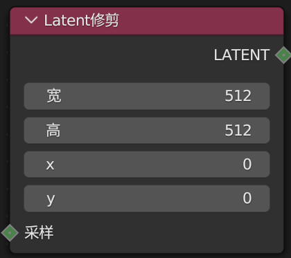

修剪 latent。

#### 宽高

* 指定要修剪出的 latent 的大小。
#### XY

* 指定修剪的 latent 的位置，坐标为左上角。
#### 特别说明

* 输出的 latent 会成为新的 latent，而不是用空 latent 覆盖外部内容
#### 相关节点

* [VAE 解码](https://shimo.im/docs/Ee32m0w80rfLp4A2#anchor-T9uA 《无限圣杯AI节点(ComfyUI)使用者手册》)
* [K 采样器](https://shimo.im/docs/Ee32m0w80rfLp4A2#anchor-UvgV 《无限圣杯AI节点(ComfyUI)使用者手册》)
* [latent 复合](https://shimo.im/docs/Ee32m0w80rfLp4A2#anchor-DRGK 《无限圣杯AI节点(ComfyUI)使用者手册》)
### VAE 解码

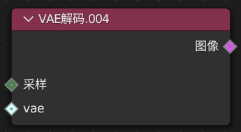

解码 latent 为图像。

#### 相关节点

* [checkpoint 简易加载器](https://shimo.im/docs/Ee32m0w80rfLp4A2#anchor-KF2C 《无限圣杯AI节点(ComfyUI)使用者手册》)
* [VAE 编码](https://shimo.im/docs/Ee32m0w80rfLp4A2#anchor-FJ4Q 《无限圣杯AI节点(ComfyUI)使用者手册》)
* [VAE 平铺解码](https://shimo.im/docs/Ee32m0w80rfLp4A2#anchor-v4pB 《无限圣杯AI节点(ComfyUI)使用者手册》)
### VAE 编码

编码图像为 latent。

#### 相关节点

* [K 采样器](https://shimo.im/docs/Ee32m0w80rfLp4A2#anchor-UvgV 《无限圣杯AI节点(ComfyUI)使用者手册》)
* [VAE 解码](https://shimo.im/docs/Ee32m0w80rfLp4A2#anchor-T9uA 《无限圣杯AI节点(ComfyUI)使用者手册》)
* [VAE 平铺编码](https://shimo.im/docs/Ee32m0w80rfLp4A2#anchor-yuDk 《无限圣杯AI节点(ComfyUI)使用者手册》)
### 空 latent 图像

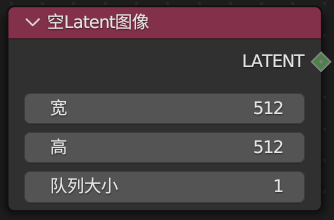

生成空 latent。

#### 宽高

* 指定 latent 大小。
#### 队列大小

* 指定同时生成的 latent 的数量。
#### 特别说明

* 同时生成的 latent 会直接输入到下游节点，当使用<VAE 解码>时会自动选择第一个 latent
* 同队列的 latent 所使用随机种是递增的，如 123、124、125
#### 相关节点

* [l](https://shimo.im/docs/Ee32m0w80rfLp4A2#anchor-DRGK 《无限圣杯AI节点(ComfyUI)使用者手册》)[atent ](https://shimo.im/docs/Ee32m0w80rfLp4A2#anchor-DRGK 《无限圣杯AI节点(ComfyUI)使用者手册》)[复合](https://shimo.im/docs/Ee32m0w80rfLp4A2#anchor-DRGK 《无限圣杯AI节点(ComfyUI)使用者手册》)
* [从队列获取latent](https://shimo.im/docs/Ee32m0w80rfLp4A2#anchor-19QR 《无限圣杯AI节点(ComfyUI)使用者手册》)
### Latent缩放

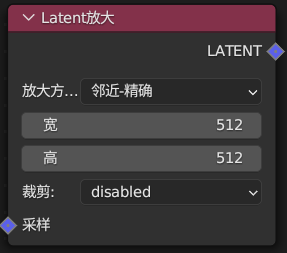

使用图像处理算法缩放latent，能够指定缩放后的大小。

#### 放大方法

* 临近-精确：复制距离原图最近的像素
* 双线性：在原图中选择相接的 4 个像素，在 2 点间插值
* area：和临近-精确相同
#### 宽高

* 指定latent要缩放到的大小
#### 裁剪

* 是否裁剪原图
* 若不开启，会拉伸latent以适配目标宽高
#### 相关节点

* [图像缩放](https://shimo.im/docs/Ee32m0w80rfLp4A2#anchor-PieC 《无限圣杯AI节点(ComfyUI)使用者手册》)
### 从队列获取 latent

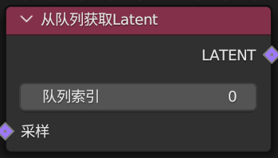

选择节点场上的 latent，数量由<队列大小>决定。

#### 队列索引

* 选择场上的 latent，0 表示第一个。
#### 相关节点

* [空 latent 图像](https://shimo.im/docs/Ee32m0w80rfLp4A2#anchor-OpNE 《无限圣杯AI节点(ComfyUI)使用者手册》)
* [VAE 解码](https://shimo.im/docs/Ee32m0w80rfLp4A2#anchor-T9uA 《无限圣杯AI节点(ComfyUI)使用者手册》)
#### 使用例

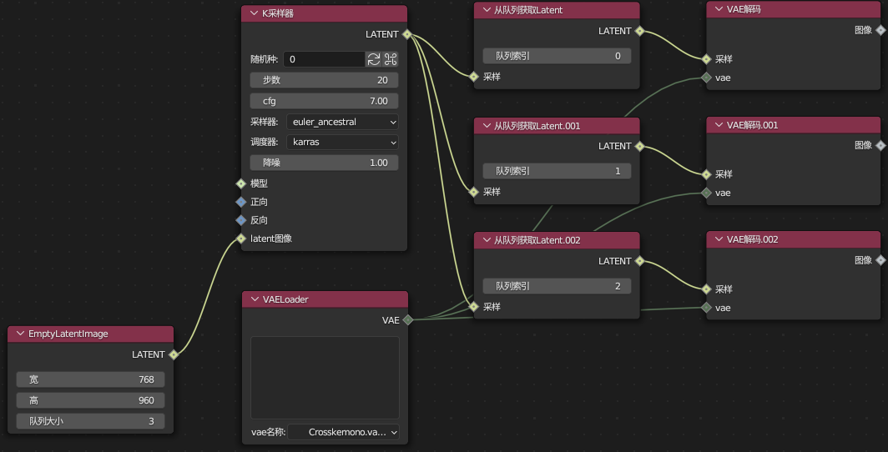

### latent 复合

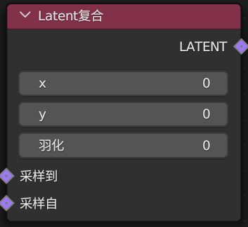

将“采样自”latent 复合到“采样到” latent 上。

#### X 和 Y

* 控制位置，坐标为“采样自”latent 左上角的第一个像素点。
#### 羽化

* “采样自”latent 从边缘到中心的羽化量。
#### 相关节点

* [空 latent 图像](https://shimo.im/docs/Ee32m0w80rfLp4A2#anchor-OpNE 《无限圣杯AI节点(ComfyUI)使用者手册》)
* [K 采样器](https://shimo.im/docs/Ee32m0w80rfLp4A2#anchor-UvgV 《无限圣杯AI节点(ComfyUI)使用者手册》)
* [Latent 遮罩复合](https://shimo.im/docs/Ee32m0w80rfLp4A2#anchor-KXj5 《无限圣杯AI节点(ComfyUI)使用者手册》)
### Latent 遮罩复合

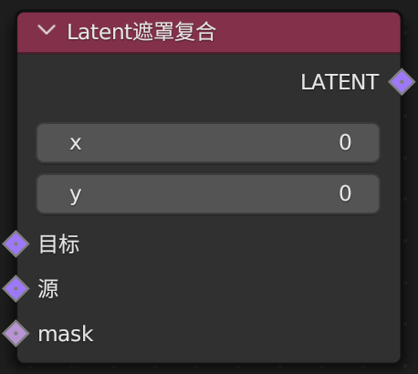

与<latent 复合>类似，不可使用羽化，可使用遮罩。

#### X 和 Y

* 指定位置，坐标为“采样自”latent 左上角的第一个像素点。
#### 特别说明

* 依据遮罩的色值混合两个 latent，输出为（1-mask）*destination+mask*source。
#### 相关节点

* [空 latent 图像](https://shimo.im/docs/Ee32m0w80rfLp4A2#anchor-DRGK 《无限圣杯AI节点(ComfyUI)使用者手册》)
## 图像

### 缩放

### 图像缩放

使用图像处理算法缩放图像，能够指定缩放后的大小。

#### 放大方法

* 临近-精确：复制距离原图最近的像素
* 双线性：在原图中选择相接的 4 个像素，在 2 点间插值
* area：和临近-精确相同
#### 宽高

* 指定图像要缩放到的大小
#### 裁剪

* 是否裁剪原图
* 若不开启，会拉伸图像以适配目标宽高
#### 相关节点

* [图像通过模型放大](https://shimo.im/docs/Ee32m0w80rfLp4A2#anchor-5JVV 《无限圣杯AI节点(ComfyUI)使用者手册》)
### 图像通过模型放大

使用放大模型放大图像。

#### 相关节点

* [图像缩放](https://shimo.im/docs/Ee32m0w80rfLp4A2#anchor-PieC 《无限圣杯AI节点(ComfyUI)使用者手册》)
### 后处理

### 图像混合

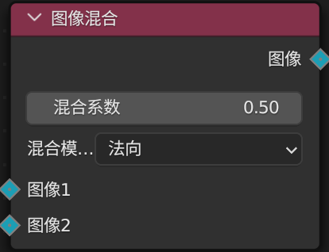

使用算法混合两个图像。

#### 混合模式

* 柔光：
    * img2 <= 0.5,
    * img1 - (1 - 2 * img2) * img1 * (1 - img1),
    * img2 > 0.5,
    * (1 - 2 * img2)* img1 * (1 - img1) + img1^2
* 叠加：
    * img1 <= 0.5,
    * 2 * img1 * img2,
    * img1 > 0.5
    * 1 - 2 * (1 - img1) * (1 - img2)
* 屏幕：1 - (1 - img1) * (1 - img2)
* 相乘：img1 * img2
* 法向：img2
### 图像模糊

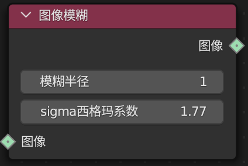

使用算法模糊图像。

#### 模糊半径

* 值越大，模糊效果越强
#### sigma 系数

* 值越大，模糊范围越大
### 图像量化

使用算法量化图像。

#### 颜色数

* 指定用于表示图像的颜色数量
#### 抖动

* 是否通过添加少量噪波的方式减少色带
### 图像锐化

使用算法锐化图像

#### 锐化半径

* 值越大，锐化范围越大
#### alpha

* 值越大，锐化强度越大
### 保存图像

在 web 端保存图像。

不适用 blender 界面。

#### 相关节点

* [存储](https://shimo.im/docs/Ee32m0w80rfLp4A2#anchor-zU1U 《无限圣杯AI节点(ComfyUI)使用者手册》)
### 预览图像

在 web 端预览图像。

不适用 blender 界面。

#### 相关节点

* [预览](https://shimo.im/docs/Ee32m0w80rfLp4A2#anchor-3UOO 《无限圣杯AI节点(ComfyUI)使用者手册》)
### 加载图像

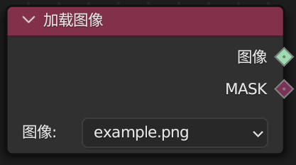

在 web 端加载图像。

不适用 blender 界面。

#### 相关节点

* [输入图像](https://shimo.im/docs/Ee32m0w80rfLp4A2#anchor-2J6R 《无限圣杯AI节点(ComfyUI)使用者手册》)
### 图像反转

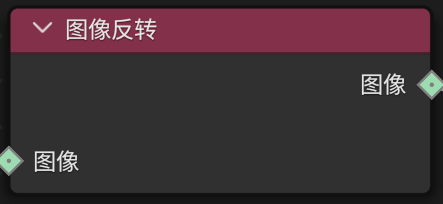

将图像中所有颜色设为反色。

### 外补绘画填充画板

适用于外补绘画的图像延申节点。

图像输出外补为 0，原图不变；遮罩输出外补为 1，原图为 0。

#### 上下左右

* 沿着指定方向向外延申
## 遮罩

### 加载图像遮罩

在 web 端加载遮罩。

不适用 blender 界面。

#### 相关节点

* [遮罩](https://shimo.im/docs/Ee32m0w80rfLp4A2#anchor-SBvb 《无限圣杯AI节点(ComfyUI)使用者手册》)
### 遮罩转图像

遮罩转图像。

### 图像转遮罩

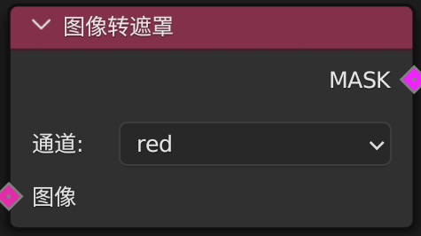

将图像按指定通道转为遮罩，遮罩为0-1的灰度图，不保留颜色。

### 纯块遮罩

生成纯块遮罩。

#### 明度

* 指定遮罩色值
#### 宽高

* 指定遮罩大小
### 反转遮罩

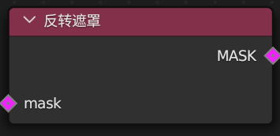

反转遮罩色值。

输出为(1 - value)。

### 遮罩裁剪

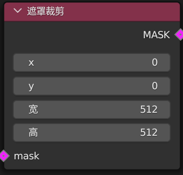

裁剪遮罩。

#### XY

* 控制裁剪的遮罩的位置，坐标为左上角。
#### 宽高

* 指定要裁剪出的的遮罩的大小。
### 遮罩混合

按算法混合两个遮罩。

#### XY

* 指定源遮罩的位置，坐标为左上角。
#### operation

* multiply：目标*源
* add：目标+源
* substract：目标-源
### 羽化遮罩

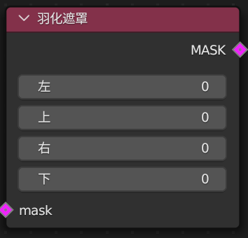

从边缘到中心羽化。

#### 上下左右

* 在指定方向上的羽化量
#### 特别说明

* 羽化为从原色值到 0 的羽化
## 测试

### VAE 平铺解码

与<VAE 解码>类似。耗时更长、质量更低、需要 VRAM 更少。

#### 相关节点

* [VAE解码](https://shimo.im/docs/Ee32m0w80rfLp4A2#anchor-T9uA 《无限圣杯AI节点(ComfyUI)使用者手册》)
### VAE 平铺编码

与<VAE 编码>类似。耗时更长、质量更低、需要 VRAM 更少。

#### 相关节点

* [VAE编码](https://shimo.im/docs/Ee32m0w80rfLp4A2#anchor-FJ4Q 《无限圣杯AI节点(ComfyUI)使用者手册》)
### Token 合并修补模型

使用 ToMe 合并模型中多余的 token，提高生成速度。

#### 比率

* 合并 token 的占比
## 高级

### 加载器

### **checkpoint 加载器**

能够加载 checkpoint(safetensor)文件中的模型、U-net、VAE 编码/解码器，输出为模型、CLIP、VAE，这个节点能够指定模型的配置文件。

不建议使用这个节点，除非你了解你正在使用的模型。

### 扩散载入器

能够加载扩散模型。

## 预处理器

### 边缘线

### Canny 预处理

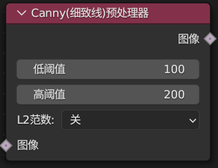

将 Canny 算法处理图像。

#### 高低阈值

* 低阈值：控制弱边缘检测阈值
* 高阈值：控制强边缘检测阈值
#### L2 范数

* 选择是否使用 L2 运算
* L2 相比 L1 提高了准确度，但降低了计算速度
### M-LSD 预处理

使用 M-LSD 算法处理图像。

#### 刻痕阈值

* 控制检测线条的阈值，置信度低于阈值的线条不被检测为边缘
#### 距离阈值

* 控制线条距离的阈值，线条间的距离低于阈值时会被合并
### HED 预处理

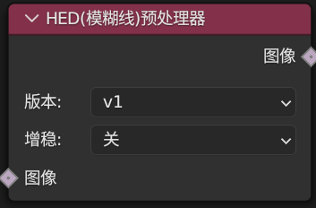

使用 HED 算法处理图像。

#### 版本

* 选择算法版本
#### 增稳

* 选择是否增稳线条，具体表现为更清晰的线条
### Scribble 预处理

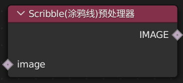

使用 Scribble 算法处理图像。

### FakeScribble 预处理

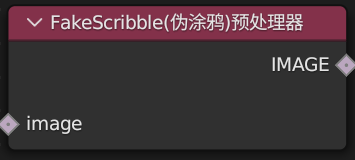

使用 FakeScribble 算法处理图像。

### Binary 预处理

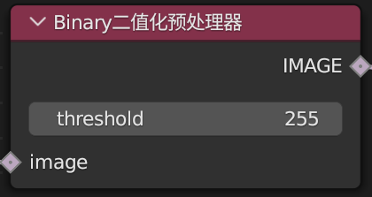

使用 Binary 算法处理图像。

#### 阈值

* 色值高于阈值的像素会被处理为 1，低于阈值的像素会被处理为 0
* 当阈值为 0 时，效果与 255 相同
### PidNet 预处理

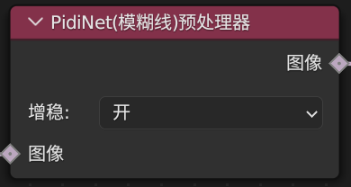

使用 Pidnet 算法处理图像。

#### 增稳

* 选择是否增稳线条，具体表现为更清晰的线条
### 法向深度映射

### Midas-DepthMap 预处理

使用 Midas 的 DepthMap 算法处理图像。

#### a

* 指定深度投影到图像的倾斜角
#### 背景阈值

* 指定移除背景的阈值
#### 相关节点

* [Leres-DepthMap 预处理](https://shimo.im/docs/Ee32m0w80rfLp4A2#anchor-ag5w 《无限圣杯AI节点(ComfyUI)使用者手册》)
* [Zoe-DepthMap 预处理](https://shimo.im/docs/Ee32m0w80rfLp4A2#anchor-1jyt 《无限圣杯AI节点(ComfyUI)使用者手册》)
### Midas-NormalMap 预处理

## 

使用 Midas 的 NormalMap 算法处理图像。

#### a

* 指定法向图的旋转角度
#### 背景阈值

* 指定移除背景的阈值
#### 相关节点

* [BAE-NormalMap 预处理](https://shimo.im/docs/Ee32m0w80rfLp4A2#anchor-SAg2 《无限圣杯AI节点(ComfyUI)使用者手册》)
### Leres-DepthMap 预处理

## 

使用 Leres 的 DepthMap 算法处理图像。

#### 前景移除

* 指定移除已识别深度前景的阈值，具体表现为大于该值的部分被1替换
#### 背景移除

* 指定移除已识别深度背景的阈值，具体表现为小于该值的部分被0替换
#### 相关节点

* [Midas-DepthMap 预处理](https://shimo.im/docs/Ee32m0w80rfLp4A2#anchor-5J2z 《无限圣杯AI节点(ComfyUI)使用者手册》)
* [Zoe-DepthMap 预处理](https://shimo.im/docs/Ee32m0w80rfLp4A2#anchor-1jyt 《无限圣杯AI节点(ComfyUI)使用者手册》)
### Zoe-DepthMap 预处理

## 

使用 Zoe 的 NormalMap 算法处理图像。

#### 相关节点

* [Midas-DepthMap 预处理](https://shimo.im/docs/Ee32m0w80rfLp4A2#anchor-5J2z 《无限圣杯AI节点(ComfyUI)使用者手册》)
* [Leres-DepthMap 预处理](https://shimo.im/docs/Ee32m0w80rfLp4A2#anchor-ag5w 《无限圣杯AI节点(ComfyUI)使用者手册》)
### BAE-NormalMap 预处理

使用 BAE 的 NormalMap 算法处理图像。

#### 相关节点

* [Midas-NormalMap 预处理](https://shimo.im/docs/Ee32m0w80rfLp4A2#anchor-eWIz 《无限圣杯AI节点(ComfyUI)使用者手册》)
### 姿态

### Openpose 预处理

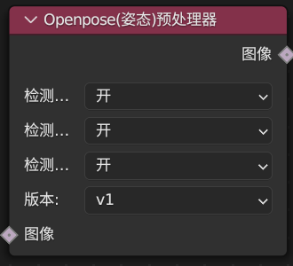

使用 Openpose 算法处理图像。

#### 检测

* 选择是否检测对应部位
#### 版本

* 选择算法版本
#### 相关节点

* [MediaPipe-HandPose 预处理](https://shimo.im/docs/Ee32m0w80rfLp4A2#anchor-IWSt 《无限圣杯AI节点(ComfyUI)使用者手册》)
### MediaPipe-HandPose 预处理

使用 MediaPipe 的 HandPose 算法处理图像。

### 检测姿态

* 选择是否检测躯干姿态
### 检测手部

* 选择是否检测手部
#### 相关节点

* [Openpose 预处理](https://shimo.im/docs/Ee32m0w80rfLp4A2#anchor-18Qf 《无限圣杯AI节点(ComfyUI)使用者手册》)
### 语义分割

### SemSeg 预处理

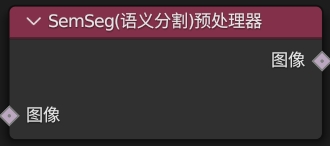

使用 SemSeg 算法处理图像。

### 面部网格

### MediaPipe-FaceMesh 预处理

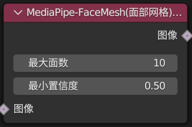

使用 MediaPipe 的 HandPose 算法处理图像。

#### 最大面数

* 指定最大检测的面部个数
#### 最小置信度

* 指定判定为面部的最小阈值
### 颜色风格

### Color 预处理

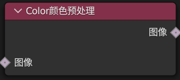

使用 Color 算法处理图像。

## Blender

### 输入图像

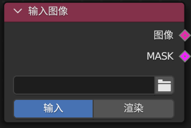

在 blender 界面加载图像。

不适用 web 端。

#### 输入模式

* 输入：直接输入图片并处理为可识别的形式
* 渲染：输入的图像可能包含渲染元素或透明通道，需要经过二次预处理
#### 相关节点

* [加载图像](https://shimo.im/docs/Ee32m0w80rfLp4A2#anchor-XDch 《无限圣杯AI节点(ComfyUI)使用者手册》)
### 遮罩

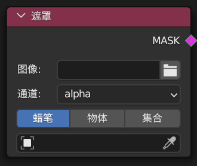

在 blender 界面加载遮罩。

不适用 web 端。

#### 输入模式

* 可以选择场景中的物体以直接输入遮罩
#### 相关节点

* [加载图像遮罩](https://shimo.im/docs/Ee32m0w80rfLp4A2#anchor-CHEo 《无限圣杯AI节点(ComfyUI)使用者手册》)
### 存储

在 blender 界面存储图像。

不适用 web 端。

#### 相关节点

* [保存](https://shimo.im/docs/Ee32m0w80rfLp4A2#anchor-fLas 《无限圣杯AI节点(ComfyUI)使用者手册》)
### 预览

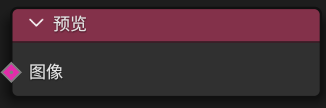

在 blender 界面预览图像。

不适用 web 端。

#### 特别说明

* 预览图像不包含图像元数据
* 预览文件夹会在每次启动时清空
#### 相关节点

* [预览](https://shimo.im/docs/Ee32m0w80rfLp4A2#anchor-djAA 《无限圣杯AI节点(ComfyUI)使用者手册》)
# 
